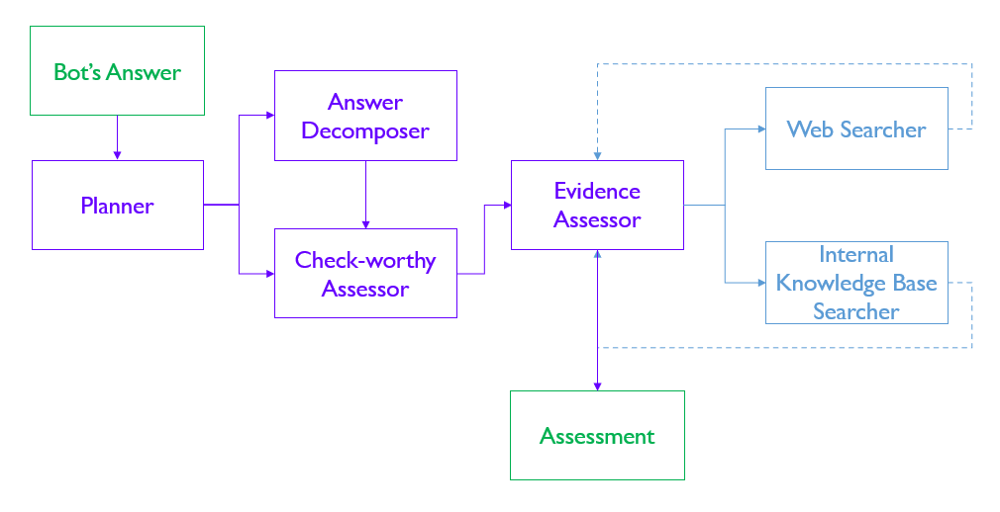

# For AI Developers

For teams building agentic AI systems, the ARC Framework provides a good starting point for thinking through the risks and controls required to manage safety and security risks. Instead of having to brainstorm a laundry list from scratch, teams can use the ARC Framework and adapt it to the specifics of their agentic AI system.

The aim of this section is to help AI development teams understand and apply the ARC Framework to their own agentic AI systems. The first sub-section provides a general explanation of how teams can apply the ARC Framework to their own agentic AI systems, and the second sub-sections provides a case study to illustrate how this would work for real-world agentic AI systems. 

## Applying the framework

In the subsequent parts, we provide a step-by-step approach for how AI developers should apply the ARC Framework to their team's agentic AI system. 

### Step 1: Identify capabilities

Begin by analysing the agentic AI system's capabilities using either [our capability taxonomy](../capability/index.md) or the one provided by your organisation. 

The easiest way to do this is to list the functions that the agentic AI system performs and compare that to the list of capabilities in the taxonomy. For example, if the system sends emails autonomously to other users, that would clearly fall under "Interaction - Official Commmunications", while being able to generate and execute Python code would qualify for "Operational - Code Execution". 

Note that the capabilities are defined on a system-level, so *even if only one agent has that capability*, that means that the system as a whole has that capability. 

### Step 2: Evaluate risks

Next, for each identified capability, map the specific risks that could arise from the system having that capability using [the ARC Framework's risk mapping](../capability/risks.md) or the one provided by your organisation. The [baseline risks](../baseline/risks.md) should also be included here.

Teams might find it helpful to further contextualise the risks to the use case. For example, defining what "undesirable" content means is important as such definitions are typically culturally specific, and focusing on the most critical topics when evaluating the risk of hallucination (e.g. medical advice, financial products) makes the risk more tractable and concrete.

Additionally, there may be other safety or security risks that are not included in our list - these may be unique to the system's operating context or arise only from a combination of specific capabilities. To brainstorm for such risks, consider thinking through failure modes by asking yourself "What is the worst scenario that could happen if this capability malfunctions or is misused?"

### Step 3: Adopt or adapt controls

Now for each risk, review the recommended technical controls which help to mitigate the risk to an acceptable level - in the ARC Framework, we provide both [baseline](../baseline/controls.md) and [capability](../capability/controls.md) controls. 

Similar to the risks in Step 2, these controls will also require some contextualisation. Not all controls are feasible or effective in every case, and teams should exercise judgement in deciding how to implement the control to meaningfully address the risk.[^1] Some organisations may choose to implement an impact level differentiation for technical controls (see next section). In that case, teams should note the distinction between mandatory and recommended controls and deal with them accordingly.

### Step 4: Assess residual risks

With the controls in place, teams should assess what the residual risks are and whether these are acceptable. As this is highly dependent on the use case, we do not provide a standard template for this assessment.[^2] Some questions that teams may consider include identifying the scenarios where harm can still occur despite the controls and what the limitations of the controls are.

If teams find that the residual risks are still unacceptable, then more controls would be needed to reduce either the likelihood or impact of the risk. 

## Case Study: Agentic Fact Checker

Fact-checking is a very time-consuming process, requiring deep thought about each claim, what evidence there is for that claim, and whether it is sufficient to support that claim. Our colleagues in the AI Practice recently developed an agentic fact-checking system (read their [Agentic AI Primer](https://playbooks.aip.gov.sg/agentic-ai-primer/09_applications_for_singapore_govt/) for details), using a complex multi-agent architecture with capabilities spanning cognitive reasoning, web search, database operations, and natural language generation to validate the veracity of any claim that is made. 

### Step 1: Identify capabilities

Figure 1: Architecture for the Agentic Fact Checker (taken from the Agentic AI Primer)

From Figure 1 above, we can see that the Agentic Fact Checker system comprises six distinct agents:

| Agent Type                   | Agent Name            | Task                                                                            |
| ---------------------------- | --------------------- | ------------------------------------------------------------------------------- |
| Core Orchestration           | Planner               | Coordinates overall fact-checking workflow and task distribution                |
| Core Orchestration           | Answer Decomposer     | Breaks down complex statements into verifiable claims                           |
| Verification Agents          | Check-worthy Assessor | Evaluates which claims require fact-checking                                    |
| Verification Agents          | Evidence Assessor     | Synthesizes information from multiple sources to make factuality determinations |
| Information Retrieval Agents | Web Searcher          | Accesses external web sources via search APIs                                   |
| Information Retrieval Agents | Internal KB Searcher  | Queries internal knowledge base for relevant information                        |

Based on the capability taxonomy from the ARC Framework, this system demonstrates the following capabilities:

| Category | Capability | Explanation |
| ----- | ----- | ----- |
| Cognitive   | Reasoning & Problem-Solving | The Answer Decomposer, Check-worthy Assessor, and Evidence Assessor agents conduct multi-step logical analyses of claims and evidence. |
| Cognitive    | Planning & Goal Management | The Planner agent assesses the entire text and determines whether a systematic decomposition of claims is needed. |
| Cognitive    | Tool Use & Delegation | The Evidence Assessor agent determines whether to searc the Internet or the internal knowledge base to validate the claim. |
| Interaction  | Natural Language Communication | All agents process text statements, while the final Evidence Assessor agent generates the factuality assessment. |
| Interaction  | Internet & Search Access | The Web Searcher agent retrieves up-to-date information from web sources. |
| Operational  | File & Data Management | The Internal KB Searcher queries and accesses internal knowledge bases. |

### Step 2: Evaluate risks

Next, we identify the risks arising from both the baseline components and the capabilities, and assess how likely and impactful the risk is given the context of the Agentic Fact Checker.

| Category | Component / Capability | Risk | Assessment |
|----------|------------------------|------|------------|
| Baseline | LLM | Poorly aligned LLMs may pursue objectives which technically satisfy instructions but violate safety principles | **Not very relevant**: Could lead to accepting biased sources as authoritative or prioritizing speed over accuracy in verification. However, fact-checking is relatively low-stakes compared to financial transactions or safety-critical systems. |
| Baseline | LLM | Weaker LLMs have a higher tendency to produce unpredictable outputs which make agent behaviour erratic | **Not very relevant**: Erratic behavior would primarily result in inconsistent fact-checking quality rather than serious harm. Users can typically verify claims independently if suspicious of results. |
| Baseline | LLM | LLMs with poor safety tuning are more susceptible to prompt injection attacks and jailbreaking attempts | **Very relevant**: Particularly relevant given web search capability. Malicious websites could inject prompts to manipulate verification results, potentially spreading misinformation systematically. |
| Baseline | LLM | Using LLMs trained on poisoned or biased data introduces manipulation risk, discriminatory decisions, or misinformation | **Not very relevant**: Could result in systematic bias in fact-checking, but impact is limited to information accuracy rather than physical or financial harm. Users can always seek alternative verification. |
| Baseline | Tools | Poorly implemented tools may not correctly verify user identity or permissions when executing privileged actions | **Not very relevant**: Fact-checker has no privileged actions. Most operations are read-only searches. Limited potential for serious harm beyond information access. |
| Baseline | Tools | Rogue tools that mimic legitimate ones can contain hidden malicious code that executes when loaded | **Not very relevant**: While concerning, the fact-checker's tools are primarily search APIs with limited system access. Potential harm is constrained compared to systems with file modification or transaction capabilities. |
| Baseline | Tools | Tools that do not properly sanitise or validate inputs can be exploited through prompt injection attacks | **Very relevant**: Critical given web search functionality. Unsanitized web content could compromise the entire verification process, leading to systematic misinformation propagation. |
| Baseline | Tools | Tools that demand broader permissions than necessary create unnecessary attack surfaces for malicious actors | **Not very relevant**: Fact-checking tools require minimal system permissions. Even if compromised, limited potential for serious system-wide damage. |
| Baseline | Instructions | Simplistic instructions with narrow metrics and without broader constraints may result in agents engaging in specification gaming, resulting in poor performance or safety violations | **Somewhat relevant**: Could lead to gaming verification metrics (e.g., always marking claims as "uncertain" to avoid errors) but unlikely to cause serious harm beyond reduced system utility. |
| Baseline | Instructions | Vague instructions may compel agents to attempt to fill in missing constraints, resulting in unpredictable actions or incorrect steps taken | **Not very relevant**: Scope of the system is clear and relatively simple, reducing the likelihood of unpredictable actions. |
| Baseline | Instructions | Instructions without a clear distinction between system prompts and user requests may confuse agents and result in greater vulnerability to prompt injection attacks | **Somewhat relevant**: Relevant given user-submitted claims for verification. Could allow users to manipulate the verification process, though impact is limited to information accuracy. |
| Baseline | Memory | Malicious actors can inject false or misleading facts into the knowledge base, resulting in the agent acting on incorrect data or facts | **Somewhat relevant**: Poisoned knowledge bases systematically bias future fact-checking decisions. However, cross-validation with web sources provides some protection against relying solely on compromised internal data. |
| Baseline | Memory | Agents may inadvertently store sensitive user or organisational data from prior interactions, resulting in data privacy risks | **Not very relevant**: Fact-checking typically involves public claims rather than sensitive personal data. Privacy risks are minimal unless checking claims about individuals. |
| Baseline | Memory | Agents may mistakenly save momentary glitches and hallucinations into memory, resulting in compounding mistakes when the agent relies on the incorrect information for its decision or actions | **Not very relevant**: Memory component in this system is not modified in response to or after the system's actions. |
| Baseline | Agentic Architecture | In linear agentic pipelines where each stage blindly trusts the previous stage, single early mistakes may be propagated and magnified | **Somewhat relevant**: Early errors in claim decomposition could propagate through verification steps, but the multi-agent architecture provides some redundancy and cross-checking opportunities. |
| Baseline | Agentic Architecture | In hub-and-spoke architectures which route all decisions through one controller agent, any bug or compromise may distributes faulty instructions across the entire system | **Not very relevant**: Agentic Fact Checker's architecture is more linear than hub-and-spoke. |
| Baseline | Agentic Architecture | More complex agentic architectures may make it difficult to fully reconstruct decision processes across multiple agents | **Not very relevant**: While transparency is important for fact-checking credibility, inability to trace decisions doesn't pose serious safety risks. Users can still evaluate final outputs independently. |
| Cognitive | Reasoning & Problem-Solving | Becoming ineffective, inefficient, or unsafe due to overthinking | **Somewhat relevant**: Overthinking may be more likely for more complex claims or texts, potentially resulting in circular or faulty reasoning. |
| Cognitive | Reasoning & Problem-Solving | Engaging in deceptive behaviour through pursuing or prioritising other goals | **Not very relevant**: Could lead to deliberately misleading fact-checks, but the multi-agent verification process provides some protection against single-agent deception. |
| Cognitive | Planning & Goal Management | Devising plans that are not effective in meeting the user's requirements | **Not very relevant**: Ineffective verification plans would reduce system utility but users can recognize obviously inadequate verification attempts. |
| Cognitive | Planning & Goal Management | Devising plans that do not adhere to common sense or implicit assumptions about the user's instructions | **Not very relevant**: May result in unnecessarily complex verification of simple claims or missing obvious evidence, but harm is limited to reduced efficiency and user frustration. |
| Cognitive | Tool Use & Delegation | Assigning tasks incorrectly to other agents | **Not very relevant**: Task misassignment might reduce verification quality but is unlikely to cause serious harm given the read-only nature of most fact-checking operations. |
| Cognitive | Tool Use & Delegation | Attempting to use other agents maliciously | **Not very relevant**: Limited potential for serious harm given the constrained scope of fact-checking operations. Most concerning would be attempts to bias verification results. |
| Interaction | Natural Language Communication | Generating undesirable content (e.g. toxic, hateful, sexual) | **Not very relevant**: Fact-checking outputs are typically factual assessments rather than creative content, and the tool is largely for internal use. |
| Interaction | Natural Language Communication | Generating unqualified advice in specialised domains (e.g. medical, financial, legal) | **Somewhat relevant**: Could provide medical or legal "facts" without appropriate disclaimers, potentially leading users to make harmful decisions based on unqualified information. |
| Interaction | Natural Language Communication | Generating controversial content (e.g. political, competitors) | **Not very relevant**: Fact-checking may involve controversial topics, but the tool is largely for internal use. |
| Interaction | Natural Language Communication | Regurgitating personally identifiable information | **Not very relevant**: Fact-checking typically focuses on public claims. PII exposure risk is minimal unless specifically checking claims about individuals. |
| Interaction | Natural Language Communication | Generating non-factual or hallucinated content | **Very relevant**: Hallucinated "facts" in verification results directly undermine the system's core purpose and could spread misinformation if users trust the assessments. |
| Interaction | Natural Language Communication | Generating copyrighted content | **Not very relevant**: Fact-checking outputs are factual assessments rather than creative content. Minimal risk of copyright infringement in normal operation. |
| Interaction | Internet & Search Access | Opening vulnerabilities to prompt injection attacks via malicious websites | **Very relevant**: Critical vulnerability given the system's reliance on web sources. Malicious sites could inject prompts to manipulate verification results, potentially spreading coordinated misinformation. |
| Interaction | Internet & Search Access | Returning unreliable information or websites | **Very relevant**: Core risk for fact-checking systems. Accepting unreliable sources as authoritative directly undermines verification accuracy and could propagate misinformation. |
| Operational | File & Data Management | Overwriting or deleting database tables or files | **Not very relevant**: Fact-checking operations are all read-only, no write access to the database or files given. |
| Operational | File & Data Management | Overwhelming the database with poor, inefficient, or repeated queries | **Not very relevant**: Would impact system performance but limited in scope to the system itself. |
| Operational | File & Data Management | Exposing personally identifiable or sensitive data from databases or files | **Not very relevant**: Fact-checking databases typically contain public information. PII exposure risk is minimal unless the system stores sensitive verification requests. |
| Operational | File & Data Management | Opening vulnerabilities to prompt injection attacks via malicious data or files | **Very relevant**: If knowledge base contains user-contributed content, malicious data could inject prompts to bias future fact-checking decisions. |

### Step 3: Adopt or adapt controls

Before we contextualise the controls, we need to assess the system impact classification first. Given that the Agentic Fact Checker is meant only for internal use, relies on publicly available data (even in its own knowledge base), and is always verified by the user prior to being used, we consider it a **low-risk use case**.

As such, we only need to tackle the "Very relevant" risks identified in Step 2.[^3] The table below shows the list of risks we have assessed to be very relevant and the corresponding controls.

| Category | Component / Capability | Risk & Assessment | Controls |
|----------|------------------------|-------|----------|
| Baseline | LLM | LLMs with poor safety tuning are more susceptible to prompt injection attacks and jailbreaking attempts   **Very relevant**: Particularly relevant given web search capability. Malicious websites could inject prompts to manipulate verification results, potentially spreading misinformation systematically. | • Implement input sanitisation measures or limit inputs to conventional ASCII characters only |
| Baseline | Tools | Tools that do not properly sanitise or validate inputs can be exploited through prompt injection attacks   **Very relevant**: Critical given web search functionality. Unsanitized web content could compromise the entire verification process, leading to systematic misinformation propagation. | • Enforce strict schema validation (e.g. JSON schema, protobuf) and reject non‑conforming inputs upstream • Escape or encode user inputs when embedding into tool prompts or commands |
| Interaction | Natural Language Communication | Generating non-factual or hallucinated content   **Very relevant**: Hallucinated "facts" in verification results directly undermine the system's core purpose and could spread misinformation if users trust the assessments. | • Implement methods to reduce hallucination rates (e.g. retrieval-augmented generation) • Implement UI/UX cues to highlight the risk of hallucination to the user • Implement features to enable users to easily verify the generated answer against the original content |
| Interaction | Internet & Search Access | Opening vulnerabilities to prompt injection attacks via malicious websites   **Very relevant**: Critical vulnerability given the system's reliance on web sources. Malicious sites could inject prompts to manipulate verification results, potentially spreading coordinated misinformation. | • Implement input guardrails to detect prompt injection or adversarial attacks • Implement escape filtering before including web content into prompts • Use structured retrieval APIs for searching the web rather than through web scraping |
| Interaction | Internet & Search Access | Returning unreliable information or websites   **Very relevant**: Core risk for fact-checking systems. Accepting unreliable sources as authoritative directly undermines verification accuracy and could propagate misinformation. | • Prioritise results from verified, high-quality domains (e.g. .gov, .edu, well-known publishers) • Require cross-source validation for some of the claims made |
| Operational | File & Data Management | Opening vulnerabilities to prompt injection attacks via malicious data or files   **Very relevant**: If knowledge base contains user-contributed content, malicious data could inject prompts to bias future fact-checking decisions. | • Validate new data used to supplement RAG databases or training data • Implement input guardrails to detect prompt injection or adversarial attacks • Disallow unknown or external files unless it is scanned |

### Step 4. Assess residual risks

After evaluating the risks and the controls, we identified three key residual risks:

1. **Sophisticated Prompt Injection** remains a significant concern as advanced adversarial websites could craft content that bypasses current guardrails, potentially leading to complete compromise of the verification process for specific claims. While we have several technical controls in place, adversarial attack techniques continue to evolve and we cannot depend on these controls to fully mitigate the threat. To manage this residual risk, we will regularly monitor the system's API calls and outputs and flag anomalous activities.

2. **Cascading Hallucination** presents a risk where early false information propagates through multiple verification steps, creating systematic bias in factuality assessments. This is particularly likely for novel or complex claims where existing knowledge bases may be incomplete, and cross-validation may not always catch sophisticated false reasoning that appears internally consistent. To manage this residual risk, we will implement a scoring and feedback mechanism in the front-end of the system to capture user feedback and to check against the system's internal reasoning for hallucinated outputs.

3. **Source Quality Assessment** poses a high-likelihood risk, especially for technical or specialised subject areas where the system may struggle to distinguish between authoritative and unreliable sources. This could result in accepting false information as verified fact, undermining the system's core purpose. To manage this residual risk, we will start with small-scale pilots for the fact checker in specific domains first, validating its responses with subject matter experts, before expanding it for more general use.

These residual risks (and measures) will be periodically reviewed by the team to ensure relevance and effectiveness.

<!-- Footnotes -->

[^1]: This is aligned to our recommendation to governance teams implementing the ARC Framework to take a comply-or-explain approach to the technical controls (see next section).
[^2]: Some helpful resources on managing residual risk include [Verizon's article](https://www.verizon.com/business/resources/articles/s/what-is-residual-risk-in-cyber-security/) or [Bitsight's article](https://www.bitsight.com/glossary/residual-risk) on residual risk.
[^3]: We recommend governance teams to require only "very relevant" risks for low-risk systems (see next section).